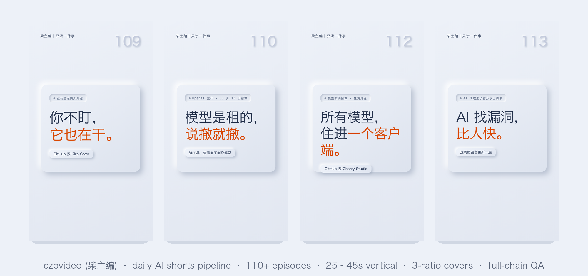

# czbvideo-ai-shorts · End-to-end daily AI shorts pipeline

> The production line behind 柴主编 (czbvideo) — an AI news shorts channel with 110+ consecutive daily episodes. Packaged as a [ZCode Skill](https://code.z.ai). [中文](README.md)

<p align="center"></p>

## What problem it solves

The hard part of daily knowledge shorts is not shooting — it is the **repeating industrial chain**: is the topic backed by evidence? Does the script sound AI-generated? Are the TTS pronunciations right? Any typos / broken line-wraps / frozen frames in the final cut? Is the publish package complete? This skill turns every step into a **gated pipeline stage** — nothing ships until the gates pass.

## Pipeline

```
topic scoring (≥70) → fact-check sources.md → script + copy QC ×4
  → MiniMax TTS + word-level timeline → HyperFrames vertical render (karaoke captions + talking avatar)
  → 3-ratio covers → 3 auto-QA scripts + independent review (P0 gate) → 15-file publish package
```

Output: 1080×1920 @30fps H.264/AAC, 25–45s, five scenes (result / pitfall / contrast / question hooks rotated), word-level karaoke captions, avatar lip-sync, three independently typeset covers.

## Install

```bash
git clone https://github.com/zhanchao717/czbvideo-ai-shorts.git ~/.agents/skills/daily-ai-shorts
```

Restart the session and the skill auto-discovers; or invoke `/skill daily-ai-shorts`.

## Prerequisites

- Python ≥ 3.9 (all five scripts are **stdlib-only, zero pip deps**)
- `ffmpeg` / `ffprobe` on PATH
- MiniMax TTS API key (`export MINIMAX_API_KEY=...`, macOS Keychain also supported)
- Optional: `GEMINI_API_KEY` (visual spot-check, gemini-3.1-flash-lite)
- Video compositing: [HyperFrames](https://hyperframes.dev) (HTML→video renderer; the design contract can be reproduced with other renderers)

## Scripts (scripts/)

| Script | Purpose |
|---|---|
| `minimax_tts.py` | MiniMax T2A voiceover, outputs mp3 + word-level timestamp JSON |
| `build_chai_timeline.py` | word-level JSON → global caption groups + audio metadata (dedup + punctuation-artifact guards) |
| `chai_check_motion.py` | final-cut spec / frozen-frame / black-frame / dead-air acceptance |
| `chai_qa_frames.py` | anchor-frame extraction along the caption timeline (number beats + scene triples) + contact sheet |
| `chai_visual_review.py` | visual spot check: sampled frames + covers, read-image typo/crop/overlap scan (Gemini) |

## Docs (progressive disclosure)

- `SKILL.md` — overview, 8 gated stages, quick start
- `references/workflow.md` — topic scoring, fact-check discipline, script rules, acceptance, retros
- `references/lessons.md` — **battle scars**: 4 TTS tokenization traps, low-contrast-skin "frozen frame" false alarms, safe-zone contracts, review false-positive triage, render discipline
- `references/design-system.md` — two validated skins (Cobalt Grid / Neumorphism Soft Slate) + layout contracts + 3-cover typesetting
- `references/research.md` — research channels and the sources.md skeleton
- `references/release-package.md` — 15-file publish package + retro rules
- `assets/examples/` — a complete real episode (fact-check / script / storyboard / copy / QC report)

## Design principles (why this is worth stealing)

1. **No delivery until acceptance passes**: three auto scripts + an independent reviewer (never the author) gating on P0; review findings are triaged against the layout contract (in practice ~1/3 are false positives).
2. **Fact / attribution / opinion are three separate things**: numbers carry their source attribution; editorial judgment is labeled "本期观点" on screen.
3. **One word-level timeline drives everything**: captions, lip-sync, number-beat frames all derive from a single JSON.
4. **The skin is a contract, not art**: coordinates / safe zones / type hierarchy are frozen; accent colors and topics rotate per episode.

## License

MIT
